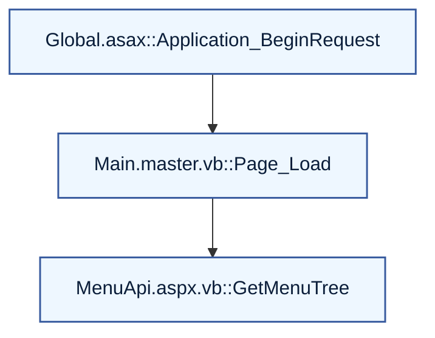
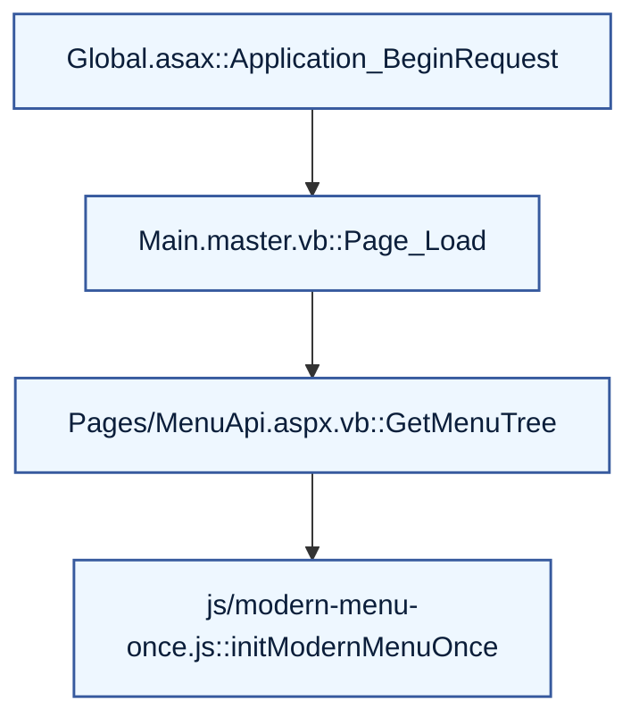

# 📝 SASERP V37 - AI Coding Agent Instructions

This document provides essential guidance for AI agents working on the SASERP V37 codebase. Understanding these patterns is crucial for making effective and consistent contributions.

## 🏛️ Architecture Overview

The project is a classic **ASP.NET WebForms application using VB.NET** as the code-behind language. It's built on the .NET Framework 4.7.2. The architecture is centered around Master Pages, User Controls (.ascx), and ASPX pages.

### Key Architectural Components:

1.  **Master Pages (`.master`):**
    -   `UniversalNavMaster.master`: The primary master page that provides the universal hamburger menu, session management, and global JavaScript configuration (`window.AppConfig`). It's the foundation for most pages.
    -   All master pages inject global CSS and JavaScript, and manage the overall page structure.

2.  **User Controls (`.ascx`):**
    -   These are reusable components that encapsulate specific functionality. The most important examples are the dashboard controls located in `~/Controls/`.
    -   **Dashboard Controls:** `FinancialDashboard.ascx`, `HRDashboard.ascx`, `OperationsDashboard.ascx`, and `ReportsDashboard.ascx` are key components. Each has a corresponding `.ascx.vb` code-behind file that handles data binding.
    -   **Universal Menu:** `UniversalHamburgerMenu.ascx` is a critical control that generates the site-wide navigation from the `Web.Sitemap`.

3.  **Data Models (`App_Code/DashboardModels.vb`):**
    -   This file contains all the data models for the dashboard system. It uses nested classes within the `DashboardModels` namespace.
    -   Each model has a `LoadSampleData()` method for providing default data, which is essential for testing and development.
    -   **Pattern:** When adding a new property to a dashboard, you must update the corresponding model class in this file first.

4.  **JavaScript Framework (`js/`):**
    -   **`mainmaster-simple.js`:** A custom, lightweight, hierarchical JavaScript framework for navigation and UI interaction. It uses a `mainmaster.pages.*` structure for page navigation.
    -   **`saserp-links-reference.js`:** Provides a `QuickNav` object for fast access to key pages and functions.
    -   **JSON Serialization:** The application avoids external libraries like `Newtonsoft.Json` in favor of the built-in `System.Web.Script.Serialization.JavaScriptSerializer`. This is a critical convention to follow.

## 🛠️ Developer Workflow

### Compilation and Debugging:

-   The project is a **Web Site Project**, not a Web Application Project. This means there's no `.vbproj` file to manage. Compilation happens dynamically at runtime.
-   **Debugging:** The most common errors are VB.NET compilation errors. These will appear in the browser when you try to access a page.
-   **Common Errors & Fixes:**
    -   `BC30456: 'Member' is not a member of 'Type'`: Usually means a property is missing from a model in `DashboardModels.vb`.
    -   `BC30648: String constants must end with a double quote`: VB.NET does not support multi-line strings. Use string concatenation with `&` and `vbCrLf`.
    -   `BC30180: Keyword does not name a type`: Typically an issue with anonymous type declaration. Use `Dim obj = New With { ... }` instead of `Dim obj As New With { ... }`.

### Testing:

-   The primary testing entry point is `~/TestPages/PagesIndex.aspx`. This page provides links to all key test pages and system guides.
-   `~/TestPages/TestDashboardData.aspx` is crucial for testing dashboard functionality. It contains WebMethods that can be called from the browser console to fetch live data.
-   **JavaScript Testing:** Use the browser's developer console to interact with the `mainmaster` and `QuickNav` objects. For example: `mainmaster.pages.test.index()` or `QuickNav.systemInfo()`.

## 📜 Conventions and Patterns

1.  **VB.NET Code-Behind:**
    -   Always use explicit type declarations (`Dim myVar As String = "..."`). Avoid relying on type inference.
    -   For multi-line strings (especially for injecting JavaScript or CSS), use the line continuation character `_` and string concatenation `&`.
        ```vb
        Dim myScript As String = _
            "document.addEventListener('DOMContentLoaded', function() {" & vbCrLf & _
            "    console.log('Hello, World!');" & vbCrLf & _
            "});"
        ```

2.  **Dashboard Development Pattern:**
    1.  **Update Model:** Add the new property to the appropriate model class in `App_Code/DashboardModels.vb`.
    2.  **Update Sample Data:** Add sample data for the new property in the `LoadSampleData()` method of the model.
    3.  **Update Test Page:** If necessary, update `TestPages/TestDashboardData.aspx.vb` to use the new property.
    4.  **Update UI (`.ascx`):** Add the new UI element (e.g., a `div` with an `asp:Label`) to the corresponding dashboard control.
    5.  **Update Code-Behind (`.ascx.vb`):** Bind the new property from the model to the new UI element in the `BindData()` or a similar method.
    6.  **Update CSS:** Add any necessary styling for the new element directly within the `.ascx` file in a `<style>` block.

3.  **File Naming:**
    -   Reports and documentation are written in Markdown and have filenames like `FINAL-SYSTEM-CHECK-AND-ENHANCEMENT-REPORT.md`.
    -   Test pages are located in the `~/TestPages/` directory.

---

# ⛓️ إضافة روابط لكل دالة داخل المخططات + مرايا HTML

Enhance the docs and flows so that EVERY function shown in any flow diagram links to its detailed documentation page.

Requirements:

1) Per-function anchors
- In each per-file doc under /docs/files/*.md, create an H3 section per public function:
  ### Function: <Name>
  Include signature, purpose, params/returns, calls/called-by, and links.
- When generating the static HTML mirror under /TestPages/Documents/docs-html/files/*.html,
  preserve anchor IDs so each function is linkable, e.g.:
  /TestPages/Documents/docs-html/files/Pages_MenuApi_aspx_vb.html#function-GetMenuTree
- Use the normalized anchor format: #function-<FunctionName> (camel/pascal kept).

2) Linkable Mermaid nodes
- For every node in Mermaid flowcharts, assign a stable node ID and add a clickable link
  to the function’s HTML anchor using Mermaid’s `click` directive.
- Example pattern:



- Use RELATIVE links so it works under virtual directories.

3) Fallback link list under each diagram
- Under every flowchart, include a Markdown table "Function Links" with one row per node:

```markdown
| Node | File | Function | Link |
|------|------|----------|------|
| A    | Global.asax | Application_BeginRequest | /TestPages/Documents/docs-html/files/Global_asax.html#function-Application_BeginRequest |
| B    | Main.master.vb | Page_Load | /TestPages/Documents/docs-html/files/Main_master_vb.html#function-Page_Load |
| C    | Pages/MenuApi.aspx.vb | GetMenuTree | /TestPages/Documents/docs-html/files/Pages_MenuApi_aspx_vb.html#function-GetMenuTree |
```

4) TOC + search
- Update /TestPages/Documents/assets/toc.json and search.json to include per-function entries
  (title, file, anchor, short summary) so the landing page search can jump directly to
  a function’s details.

5) Link hygiene
- Convert all /docs/*.md links in generated HTML to their /TestPages/Documents/docs-html/* equivalents.
- Validate links; report any missing anchors at the end of the run.

Deliverables to update:
- docs/flows/call-graph.md (with click directives + function links tables)
- docs/files/*.md (add ### Function: sections + anchors)
- TestPages/Documents/docs-html/** (mirrors with preserved anchors)
- TestPages/Documents/assets/{toc.json,search.json} (include function-level entries)

## مثال سريع Reference (يُنسخ على كل الرسومات)



وتحت الرسم:

```markdown
### Function Links
| Node | File                         | Function                | Link |
|-----:|------------------------------|-------------------------|------|
| A    | Global.asax                  | Application_BeginRequest| /TestPages/Documents/docs-html/files/Global_asax.html#function-Application_BeginRequest |
| B    | Main.master.vb               | Page_Load               | /TestPages/Documents/docs-html/files/Main_master_vb.html#function-Page_Load |
| C    | Pages/MenuApi.aspx.vb        | GetMenuTree             | /TestPages/Documents/docs-html/files/Pages_MenuApi_aspx_vb.html#function-GetMenuTree |
| D    | js/modern-menu-once.js       | initModernMenuOnce      | /TestPages/Documents/docs-html/files/js_modern-menu-once_js.html#function-initModernMenuOnce |
```
