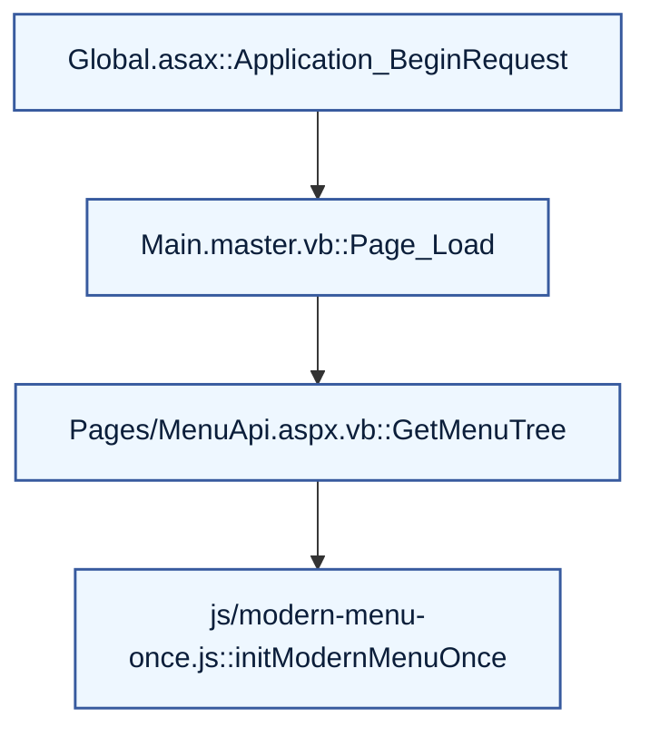

# Flows and Call Graph

Entry points:
- Global.asax: ApplicationServices.Initialize(); Session hooks
- Master pages: Main.master, UniversalNavMaster.master (layout, menu)
- Default.aspx (home)
- Services/DataControllerService.asmx (ScriptService WebMethods)
- Pages/MenuApi.aspx (WebMethod GetMenuTree)
- Numerous ASPX/ASCX pages under Pages/ with code-behind events

Generic lifecycle:
- Request -> Global.asax -> Authenticate (Forms) -> Authorization (<location>) -> Master Page Init/Load -> Page_Init/Page_Load -> controls lifecycle -> render -> client JS

Menu JSON path:
- Client click toggle -> js/modern-menu-once.js -> POST /Pages/MenuApi.aspx/GetMenuTree -> MenuApi.GetMenuTree() -> SiteMap.RootNode children -> BuildNode() recursive -> CacheDependency(web.sitemap) -> JSON -> renderTree()

Data service path:
- Client script -> ASMX -> ControllerFactory.* -> eZee.Data controllers -> DB

---

Reference flow with linkable function nodes:

### Function Links
| Node | File                         | Function                 | Link |
|-----:|------------------------------|--------------------------|------|
| A    | Global.asax                  | Application_BeginRequest | /TestPages/Documents/docs-html/files/Global.asax.html#function-Application_BeginRequest |
| B    | Main.master.vb               | Page_Load                | /TestPages/Documents/docs-html/files/Main.master.html#function-Page_Load |
| C    | Pages/MenuApi.aspx.vb        | GetMenuTree              | /TestPages/Documents/docs-html/files/Pages_MenuApi.aspx.vb.html#function-GetMenuTree |
| D    | js/modern-menu-once.js       | initModernMenuOnce       | /TestPages/Documents/docs-html/files/js_modern-menu-once.js.html#function-initModernMenuOnce |
