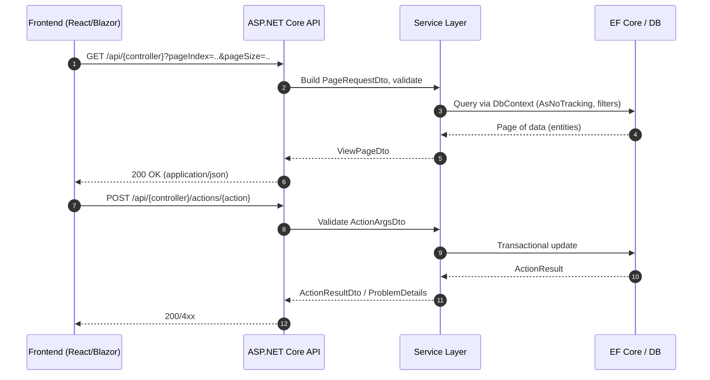

# Modern Sequence (H→L)

Links:
- DataControllerService (legacy): ../TestPages/Documents/docs-html/files/App_Code_Services_DataControllerService.vb.html
- Main.master: ../TestPages/Documents/docs-html/files/Main.master.html
- Menu API: ../TestPages/Documents/docs-html/files/Pages_MenuApi.aspx.vb.html
- RepresentationalStateTransfer: ../TestPages/Documents/docs-html/files/App_Code_Services_RepresentationalStateTransfer.vb.html
- dataview-runtime-adapter.js: ../files/js_dataview-runtime-adapter.js.md
